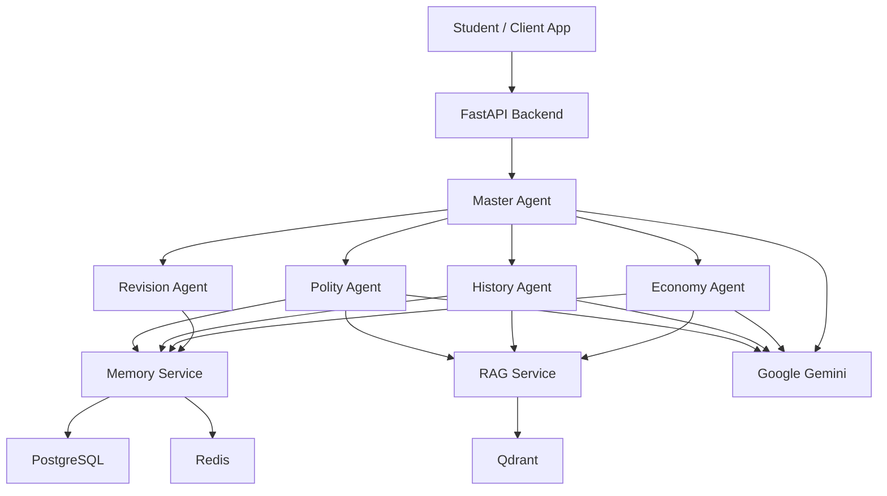
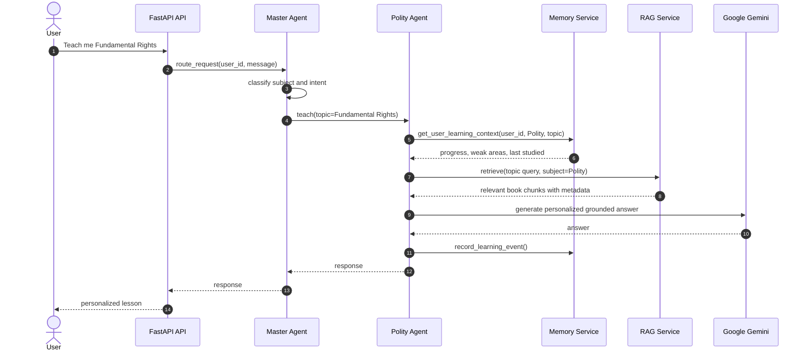
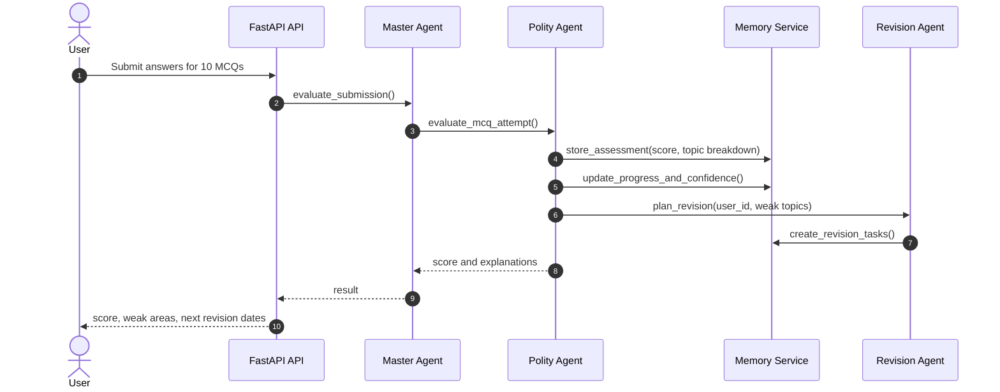
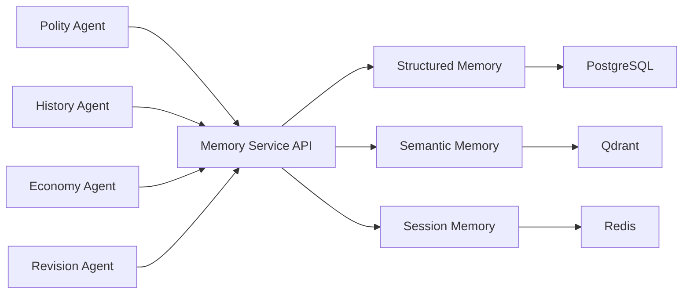
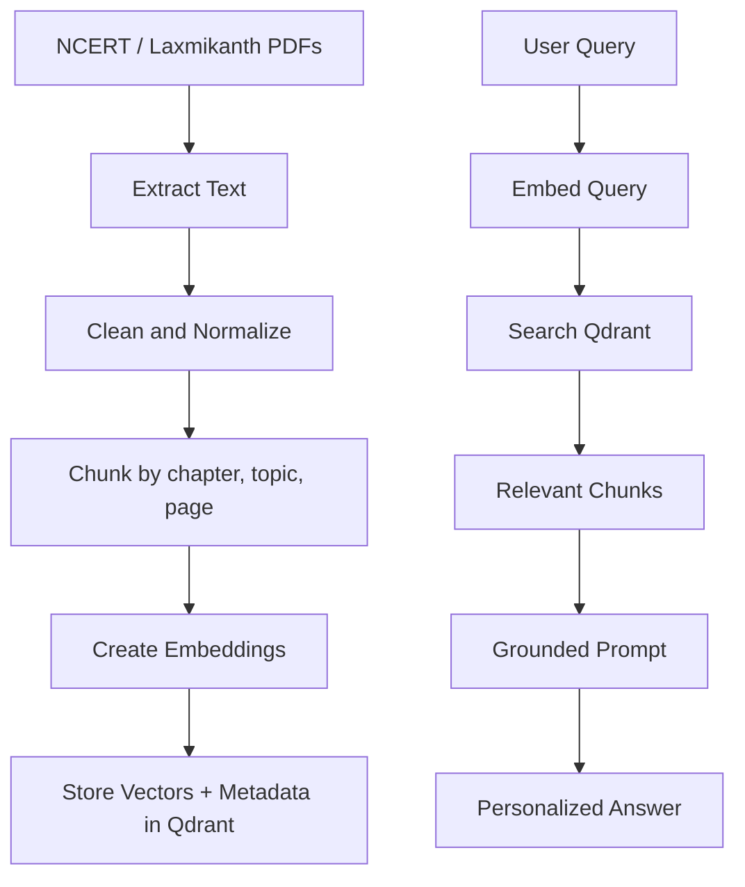
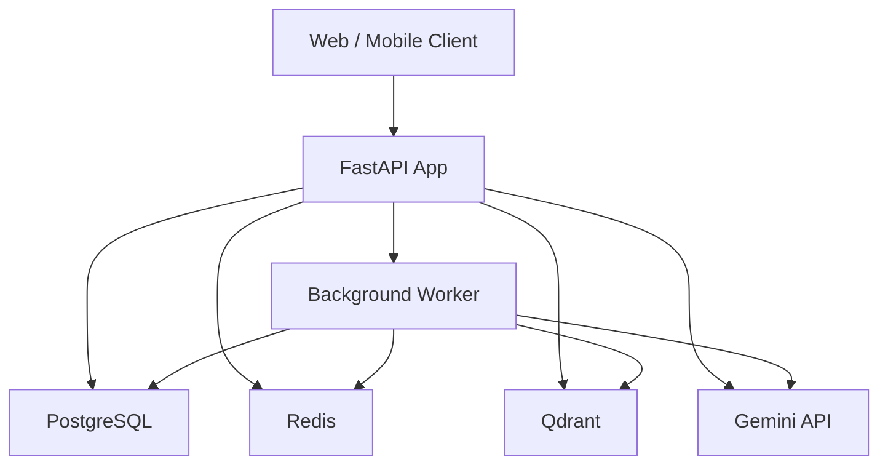

# AI University Architecture

## Architecture Goal

AI University should behave like a personalized UPSC coaching institute:

- It routes each request to the right expert.
- It remembers the student's progress.
- It retrieves trusted book material before answering.
- It turns performance into revision plans.
- It can grow one subject at a time without rewriting the core.

The design keeps agents stateless and moves durable state into shared services.

## System Context

## High-Level Components

### API Layer

Responsibilities:

- Authenticate users.
- Validate requests.
- Expose stable HTTP contracts.
- Attach request IDs.
- Call application services.

Non-responsibilities:

- No direct prompt construction.
- No direct database writes for learning state.
- No subject-specific teaching logic.

### Master Agent

Responsibilities:

- Understand user intent.
- Select the correct subject agent or workflow.
- Provide routing context.
- Handle unsupported or ambiguous requests.

Non-responsibilities:

- Does not teach Polity, History, or Economy.
- Does not own user memory.
- Does not directly query books unless implementing a generic workflow.

### Subject Agents

Responsibilities:

- Teach subject topics.
- Generate quizzes and explanations.
- Use memory for personalization.
- Use RAG for grounded source context.
- Emit learning events back to Memory Service.

Initial subject:

- Polity Agent

Future subjects:

- History Agent
- Economy Agent
- Current Affairs Agent

### Memory Service

Responsibilities:

- Own structured memory in PostgreSQL.
- Own semantic memory writes and retrieval coordination.
- Own session state in Redis.
- Provide a single API for all agents.

Memory types:

- Structured Memory: facts and progress.
- Semantic Memory: meaningful learning observations.
- Session Memory: temporary active-session state.

### RAG Service

Responsibilities:

- Ingest books and notes.
- Chunk source material.
- Create embeddings.
- Retrieve relevant chunks for a query.
- Return source metadata.

Initial sources:

- NCERT PDFs.
- Laxmikanth.

### Revision Agent

Responsibilities:

- Convert weak performance into spaced revision tasks.
- Schedule review reminders.
- Surface due revision items.
- Update revision outcomes after review.

## Request Flow: Teaching

## Request Flow: MCQ Submission

## Shared Memory Architecture

## RAG Pipeline

## Deployment View

## Data Ownership

PostgreSQL owns:

- Users.
- Subjects.
- Topics.
- Progress.
- Assessments.
- Revision tasks.
- Book metadata.

Qdrant owns:

- Book chunk embeddings.
- Semantic user learning observations.

Redis owns:

- Active study session state.
- Short-lived workflow state.
- Idempotency locks where needed.

Agents own:

- Runtime reasoning.
- Tool selection.
- Prompt assembly.
- Response shaping.

Agents do not own:

- Durable progress.
- Book storage.
- Scheduled tasks.
- Authentication.

## Reliability Principles

- Every external call has timeout and retry policy.
- LLM calls are wrapped behind interfaces.
- Prompt inputs and outputs are logged safely.
- Workflow steps emit domain events.
- Revision scheduling is idempotent.
- RAG ingestion can be rerun without duplicate chunks.
- Failed background jobs are observable and retryable.

## Security and Privacy Principles

- Do not store raw secrets in code.
- Use environment variables for API keys.
- Keep user memory access scoped by user ID.
- Avoid logging full personal study history in plain logs.
- Store source document metadata separately from user state.
- Make deletion and export of user memory possible later.
