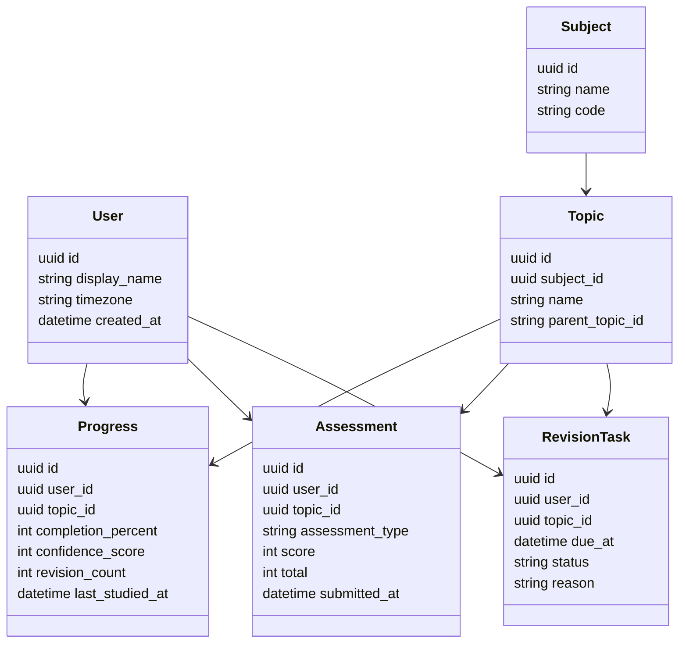
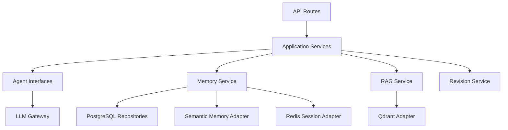

# AI University Low-Level Design

## Proposed Repository Layout

```text
ai-university/
  app/
    main.py
    api/
      routes/
        chat.py
        memory.py
        revision.py
        health.py
      dependencies.py
    core/
      config.py
      logging.py
      errors.py
    domain/
      users.py
      subjects.py
      topics.py
      progress.py
      assessments.py
      revision.py
      documents.py
    application/
      master_router.py
      teaching_service.py
      quiz_service.py
      revision_service.py
      ingestion_service.py
    agents/
      master_agent.py
      polity_agent.py
      contracts.py
      prompts/
        master.md
        polity_teach.md
        polity_mcq.md
    memory/
      service.py
      structured.py
      semantic.py
      session.py
    rag/
      ingestion.py
      chunking.py
      embeddings.py
      retrieval.py
      models.py
    infrastructure/
      db/
        models.py
        migrations/
        repositories.py
      vector/
        qdrant_client.py
      cache/
        redis_client.py
      llm/
        openai_client.py
      scheduler/
        apscheduler.py
    tests/
      unit/
      integration/
      e2e/
```

## Core Domain Entities



## PostgreSQL Tables

### users

```text
id uuid primary key
display_name text not null
timezone text not null default 'Asia/Calcutta'
created_at timestamptz not null
updated_at timestamptz not null
```

### subjects

```text
id uuid primary key
code text unique not null
name text not null
created_at timestamptz not null
```

### topics

```text
id uuid primary key
subject_id uuid not null references subjects(id)
parent_topic_id uuid null references topics(id)
name text not null
slug text not null
created_at timestamptz not null
unique(subject_id, slug)
```

### progress

```text
id uuid primary key
user_id uuid not null references users(id)
topic_id uuid not null references topics(id)
completion_percent int not null check (completion_percent between 0 and 100)
confidence_score int not null check (confidence_score between 1 and 10)
revision_count int not null default 0
last_studied_at timestamptz null
created_at timestamptz not null
updated_at timestamptz not null
unique(user_id, topic_id)
```

### assessments

```text
id uuid primary key
user_id uuid not null references users(id)
topic_id uuid not null references topics(id)
assessment_type text not null
score int not null
total int not null
weaknesses jsonb not null default '[]'
submitted_at timestamptz not null
```

### revision_tasks

```text
id uuid primary key
user_id uuid not null references users(id)
topic_id uuid not null references topics(id)
due_at timestamptz not null
status text not null
reason text not null
source_assessment_id uuid null references assessments(id)
created_at timestamptz not null
completed_at timestamptz null
unique(user_id, topic_id, due_at, reason)
```

### documents

```text
id uuid primary key
title text not null
source_type text not null
subject_id uuid null references subjects(id)
version_hash text not null
created_at timestamptz not null
unique(title, version_hash)
```

### document_chunks

```text
id uuid primary key
document_id uuid not null references documents(id)
qdrant_point_id text unique not null
chunk_index int not null
page_start int null
page_end int null
chapter text null
topic_hint text null
content_hash text not null
created_at timestamptz not null
unique(document_id, content_hash)
```

## Qdrant Collections

### book_chunks

Purpose: trusted source retrieval for RAG.

Payload:

```json
{
  "document_id": "uuid",
  "title": "Indian Polity",
  "subject": "Polity",
  "chapter": "Fundamental Rights",
  "topic_hint": "Article 32",
  "page_start": 123,
  "page_end": 124,
  "content_hash": "sha256"
}
```

### semantic_memory

Purpose: meaningful user learning observations.

Payload:

```json
{
  "user_id": "uuid",
  "subject": "Polity",
  "topic": "DPSP",
  "observation_type": "confusion",
  "observation": "User confuses DPSP with Fundamental Rights",
  "created_at": "2026-06-15T00:00:00Z"
}
```

## Redis Keys

Current study session:

```text
session:{user_id}:{session_id}
```

Value:

```json
{
  "subject": "Economy",
  "topic": "Inflation",
  "started_at": "2026-06-15T10:00:00Z",
  "time_spent_seconds": 5400,
  "current_mcq_score": 78
}
```

Idempotency lock:

```text
lock:revision:{user_id}:{assessment_id}
```

## Primary API Contracts

### Chat

```http
POST /api/v1/chat
```

Request:

```json
{
  "user_id": "uuid",
  "message": "Teach me Fundamental Rights",
  "session_id": "optional-session-id"
}
```

Response:

```json
{
  "answer": "string",
  "subject": "Polity",
  "topic": "Fundamental Rights",
  "sources": [
    {
      "title": "Indian Polity",
      "chapter": "Fundamental Rights",
      "page_start": 123,
      "page_end": 124
    }
  ],
  "next_actions": ["Generate MCQs", "Revise writs"]
}
```

### Generate MCQs

```http
POST /api/v1/subjects/{subject_code}/topics/{topic_slug}/mcqs
```

Request:

```json
{
  "user_id": "uuid",
  "count": 10,
  "difficulty": "mixed"
}
```

Response:

```json
{
  "assessment_id": "uuid",
  "questions": [
    {
      "id": "uuid",
      "stem": "Which article provides constitutional remedies?",
      "options": ["Article 19", "Article 21", "Article 32", "Article 44"]
    }
  ]
}
```

### Submit MCQs

```http
POST /api/v1/assessments/{assessment_id}/submit
```

Request:

```json
{
  "user_id": "uuid",
  "answers": [
    {
      "question_id": "uuid",
      "selected_option": "Article 32"
    }
  ]
}
```

Response:

```json
{
  "score": 4,
  "total": 10,
  "weak_topics": ["Fundamental Rights", "Writs"],
  "revision_dates": ["2026-06-16", "2026-06-22", "2026-07-15"],
  "explanations": []
}
```

### Due Revisions

```http
GET /api/v1/users/{user_id}/revisions/due
```

Response:

```json
{
  "items": [
    {
      "revision_task_id": "uuid",
      "subject": "Polity",
      "topic": "Fundamental Rights",
      "due_at": "2026-06-16T09:00:00+05:30",
      "reason": "Low MCQ score"
    }
  ]
}
```

## Application Service Boundaries



Rules:

- API routes call application services.
- Application services coordinate use cases.
- Agents call service interfaces, not raw infrastructure.
- Infrastructure adapters implement interfaces defined by application/domain layers.
- Tests should cover domain and application behavior without requiring live LLM calls.

## Agent Contracts

### MasterAgent

```python
class MasterAgent:
    async def route(self, command: UserCommand) -> RoutedCommand:
        ...
```

Expected output:

```text
subject: Polity | History | Economy | CurrentAffairs | Unknown
intent: Teach | GenerateMCQ | EvaluateMCQ | Revise | Explain | Compare
topic: optional topic name
confidence: routing confidence
```

### SubjectAgent

```python
class SubjectAgent:
    async def teach(self, request: TeachRequest) -> TeachResponse:
        ...

    async def generate_mcqs(self, request: McqRequest) -> McqResponse:
        ...

    async def evaluate_mcqs(self, request: McqSubmission) -> EvaluationResponse:
        ...
```

## Prompt Assembly Order

For teaching:

1. System instruction.
2. Subject teaching style.
3. User learning context from Memory Service.
4. Relevant RAG chunks.
5. User request.
6. Output constraints.

For MCQs:

1. System instruction.
2. Topic and difficulty.
3. User weak areas.
4. Relevant source chunks.
5. Required JSON schema.

## Revision Policy

Initial rule:

- Score below 60 percent: schedule +1 day, +7 days, +30 days.
- Confidence 5 or below: schedule +1 day and +7 days.
- Repeated weakness: increase priority.

This should be implemented as a policy object so it can be tested and changed without touching scheduler infrastructure.

## Testing Strategy

Unit tests:

- Domain policies.
- Revision scheduling.
- Routing rules.
- Prompt builders.
- Chunking logic.

Integration tests:

- PostgreSQL repositories.
- Redis session store.
- Qdrant retrieval adapter.
- Ingestion idempotency.

End-to-end tests:

- Teach topic.
- Generate MCQs.
- Submit answers.
- Store weak topic.
- Create revision tasks.

LLM tests:

- Use snapshot-style contract tests for prompt inputs.
- Use mocked LLM responses for deterministic CI.
- Add evaluation datasets later for answer quality.

## Error Handling

Use typed application errors:

- `UnknownSubjectError`
- `TopicNotFoundError`
- `RetrievalUnavailableError`
- `LlmUnavailableError`
- `MemoryWriteError`
- `RevisionSchedulingError`

Return user-safe messages while logging diagnostic context with request IDs.

## Observability Fields

Every major workflow should log:

```text
request_id
user_id
session_id
workflow
subject
topic
agent
latency_ms
llm_model
retrieval_chunk_count
error_code
```

Avoid logging sensitive raw user history unless explicitly needed for local debugging.
