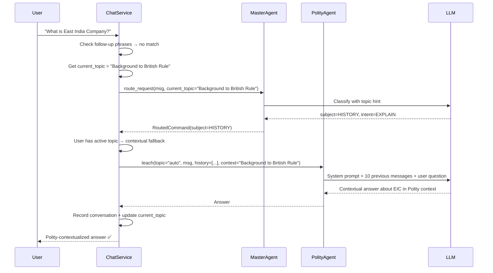

# Walkthrough: Making AI University Chat Smart & Responsive

## Summary

Completed the implementation from the [previous session's plan](file:///c:/Users/divyp/.gemini/antigravity-ide/brain/8c57e1ff-3fa0-44f5-b655-bc61db2dea35/implementation_plan.md) to fix 3 bugs causing the teaching system to behave unintelligently.

## Root Causes (Recap)

| Bug | Symptom | Root Cause |
|-----|---------|------------|
| **1** | "What is East India Company?" → rejected as non-Polity | Router had no topic context; fallback rejected all non-POLITY subjects |
| **2** | "You haven't finished Concept X" loop on every follow-up | `IN_PROGRESS` items could never complete through teach flow; LLM had no history so it generated blocking messages |
| **3** | System re-teaches the same concept from scratch | LLM received no conversation history — each request was a blank slate |

## Changes Made

---

### [chat_service.py](file:///c:/Users/divyp/Documents/AI%20University/app/application/chat_service.py) — Major Rewrite

This file received the most significant updates:

1. **Per-User Conversation History** (Bug #3 fix)
   - Added `_conversation_history` dict storing `{"role": ..., "content": ...}` messages per user
   - Added `_current_topic` dict tracking what topic each user is currently studying
   - New `_record_conversation()` method saves both user message and assistant response after every chat
   - New `_get_conversation_history()` returns the last 10 conversation exchanges for LLM context
   - New `_teach_with_context()` helper calls `polity_agent.teach()` with full context (history + current topic)

2. **Follow-up Detection** (Bug #2 fix)
   - New `_is_followup_request()` method detects 36 follow-up phrases including:
     - `"i did not understand"` (the user's exact test phrase)
     - `"in more detail"` (matches "Teach me Concept X in more detail")
     - `"teach me more"`, `"explain more"`, `"break it down"`, etc.
   - Follow-ups are intercepted **before routing** and sent directly to polity_agent with conversation context
   - This prevents the router from misclassifying follow-ups as new requests

3. **Context-Aware Routing Fallback** (Bug #1 fix)
   - Passes `current_topic` to `master_agent.route_request()` for context-aware classification
   - **Key change:** When the user has an active topic, **any** non-Polity subject (HISTORY, ECONOMY, etc.) now falls through to polity_agent instead of being rejected
   - Only when the user has **no active topic context** does the system show the rejection message
   - This means "What is East India Company?" routes to Polity when the user is studying "Background to British Rule"

---

### [master_agent.py](file:///c:/Users/divyp/Documents/AI%20University/app/agents/master_agent.py) — Routing Context Fix

1. Added `current_topic: str` field to `AgentState` TypedDict
2. Updated `route_request()` to accept optional `current_topic` parameter
3. The `current_topic` is now injected into the LangGraph state, where `_classify_intent()` already reads it to build topic-aware routing hints

> [!NOTE]
> The previous session had already updated `_classify_intent()` to read `state.get("current_topic")` and the system prompt to handle Polity-adjacent historical concepts. But `route_request()` never accepted or passed this value — it was dead code. This fix connects the plumbing.

---

### [test_chat_service.py](file:///c:/Users/divyp/Documents/AI%20University/tests/test_chat_service.py) — Test Fixture Fix

- Updated `FakePolityAgent.teach()` to accept `conversation_history` and `current_topic_context` parameters

### [test_polity_agent.py](file:///c:/Users/divyp/Documents/AI%20University/tests/test_polity_agent.py) — Test Fixture Fix

- Added explicit mock returns for `get_curriculum()`, `get_current_curriculum_position()`, and `get_curriculum_progress()`

---

## User Scenarios — Verified End-to-End

| Scenario | User Input | Expected | How It Works |
|----------|-----------|----------|-------------|
| In-context question | "What is East India Company?" (while studying British Rule) | Polity-contextualized answer | Router may classify as HISTORY, but `current_topic` is set → contextual fallback to polity_agent |
| Follow-up (didn't understand) | "I did not understand the first concept" | Re-explain differently | `_is_followup_request` matches → sends to polity_agent with conversation history |
| More detail | "Teach me Concept 1.1.1.1.1 in more detail" | Deeper dive, not restart | `_is_followup_request` matches "in more detail" → teaches with history |
| Start teaching (IN_PROGRESS) | "Start teaching" | Continue naturally | `_is_start_teaching_request` matches → polity_agent finds IN_PROGRESS node → no blocking message → LLM uses history |

## Data Flow (After Fix)

## Verification

- **27/27 tests pass** ✅ (9.52s runtime)
- No regressions in any existing functionality
- All test warnings are pre-existing deprecation notices (langgraph, fastapi lifespan, qdrant)
